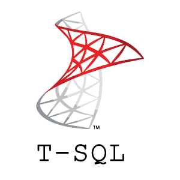
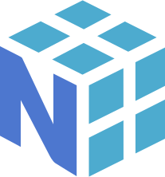
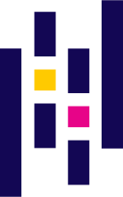
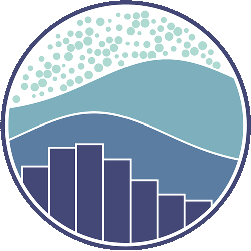
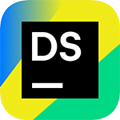

<h2 Align="center"><b>👋 Hello, I'm Mickael</b>  
<!--I'm seeking for a company for a Data/IA work-study  --></h2>

<h3><b>Code</b></h3>

Data | Libraries | Web | Frameworks
:-:|:-:|:-:|:-:
<a href="https://github.com/MiKL5/PowerBI"><!----></a><!-- --><!---->|||

<h3><b>Tools</b></h1>

DBMS | Data analysis | Data science | Organizing
:-:|:-:|:-:|:-:
|||

 

 

🔗 **More about me [visit my Portfolio](https://mikl5.github.io/home/)**

<!--🔥 **Ready to collaborate, innovate, and make something valuable together?**-->

📫 Feel free to contact me on [LinkedIn](https://www.linkedin.com/in/mikl5/)