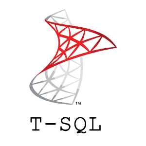

<h1 Align="center" style="color: #E9D6AA; filter:drop-shadow(5px 5px 3px #664B0B6e)"><b>👋 Hello, I'm Mickael</b></h1>

<h3 align="center"><i>💭 Ask me about AI!</i></h1>
<!-- 
 -->

<h2><b>Front-end</b></h1>

Languages | Libraries | Frameworks
:-:|:-:|:-:
 |  <!--  --> |  

  

<h2><b>Back-end</b></h1>

Languages | Frameworks
:-:|:-:
                          <a href="#">                                                                                                                                                                                                                                                             | 

  

<h2><b>Applications</b></h1>

| Langages |
:-:
  

<!-- <h2><b>Data analysis</b></h2> -->

<h2><b>Tools</b></h1>

Versionning | RDBMS | Data analysis | Design | Organization
:-:|:-:|:-:|:-:|:-:
 |      |  |   |    

