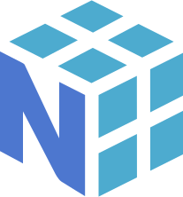
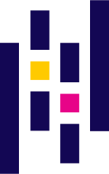

<h1 Align="center" style="color: #E9D6AA; filter:drop-shadow(5px 5px 3px #664B0B6e)"><b>👋 Hello, I'm Mickael</b></h1>

<!-- <h3 align="center"><i>💭 Ask me about AI!</i></h1>  -->
<!-- 
 -->

<h2><b>Applications</b></h1>

Languages | Libraries
:-:|:-:
<a href="https://github.com/MiKL5/afpaDev"><!---->  </a>       |  

<h2><b>Web</b></h1>

Languages | Frameworks
:-:|:-:
  |  

<h2><b>Tools</b></h1>

DBMS | Data analysis | Organizing
:-:|:-:|:-:
   |   | 
